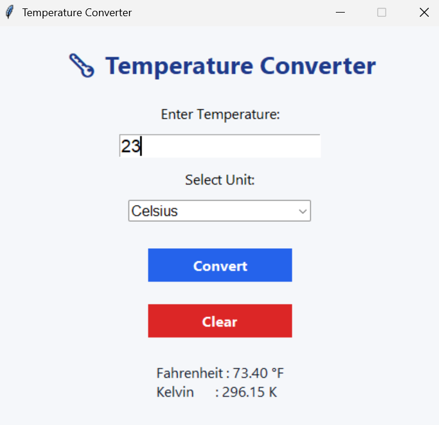
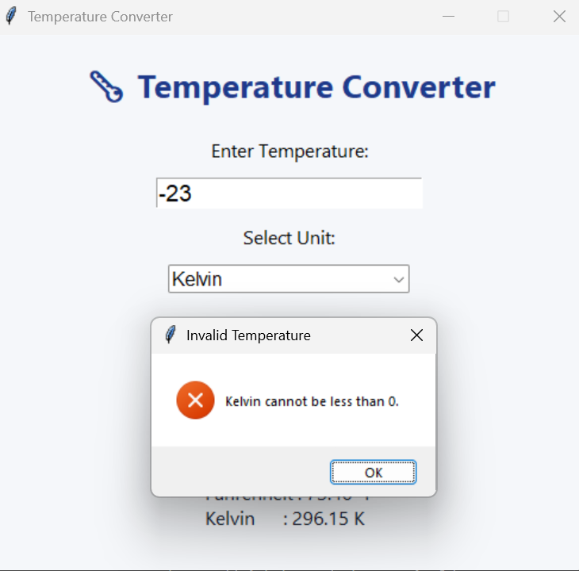

# Temperature Converter

A simple and user-friendly **Temperature Converter** application built using **Python** and **Tkinter** as part of my **Software Development Internship** at **Prodigy InfoTech**.

##  Overview

This application allows users to convert temperatures between **Celsius**, **Fahrenheit**, and **Kelvin** through an interactive graphical user interface (GUI). It provides accurate conversions, validates user input, and offers a clean and intuitive experience.

---

## Features

- Convert temperatures between:
  - Celsius
  - Fahrenheit
  - Kelvin
- Interactive GUI built with Tkinter
- User-friendly interface
- Input validation for invalid values
- Prevents negative Kelvin values
- Clear button to reset inputs and results
- Supports Enter key for quick conversion

---

## Technologies Used

- Python 3
- Tkinter (GUI Library)

---

## Project Structure

```
PRODIGY_SD_01/
│
├── temperature_converter.py
├── README.md
└── screenshots/
```

---

##  Getting Started

### Prerequisites

- Python 3.x installed

### Run the Application

1. Clone the repository

```bash
git clone https://github.com/RohanNautiyal/PRODIGY_SD_01.git
```

2. Navigate to the project folder

```bash
cd PRODIGY_SD_01
```

3. Run the application

```bash
python temperature_converter.py
```

---

## 📸 Screenshots

## Screenshots

### Home Screen


### Temperature Conversion


### Kelvin Validation


---

##  Learning Outcomes

Through this project, I learned:

- GUI development using Tkinter
- Event-driven programming
- Temperature conversion logic
- Input validation and error handling
- Basic Git and GitHub workflow
- Version control using meaningful commits

---

## License

This project is developed for educational purposes as part of the **Prodigy InfoTech Software Development Internship**.

---

## Author

**Rohan Nautiyal**

Software Development Intern at Prodigy InfoTech
